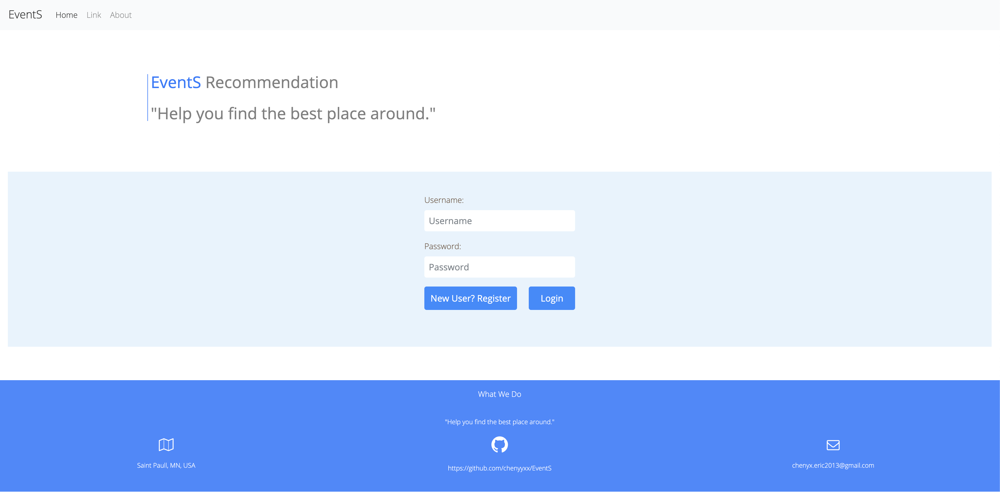
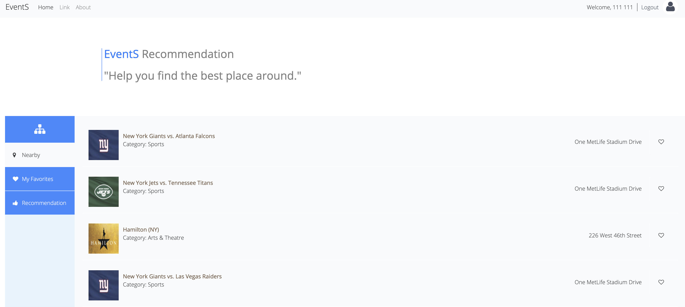
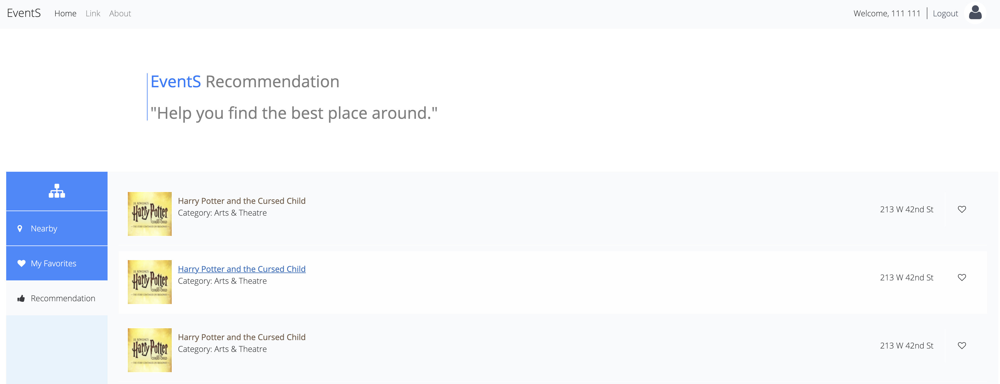

# EventS
A Java Web Service based Event Search and Ticket Recommendation website

### Website Link

Go to [EventS: http://3.22.183.101/EventS/](http://3.22.183.101/EventS/) to explore the website

You must register to be able to use the event/ticket search and recommendation functions.

### Website Snapshots

**Login**

**MainPage - Nearby**

**MainPage - Recommendation**

### Website Development
- Frontend: Utilized HTML/CSS/JavaScript to develop an interactive web page for users to search events and purchase tickets
- Database: Built relational (MySQL) and NoSQL (MongoDB) databases to capture real business data from TicketMaster API
- Business Logic Implementation: Implemented a content-based recommendation algorithm to improve personalized recommendation based on search history and favorite records
- Backend: Created 6 Java servlets with RESTful APIs to handle HTTP requests and responses
- Deployment: Deployed server side to Amazon EC2 to handle 150 QPS tested by Apache JMeter
